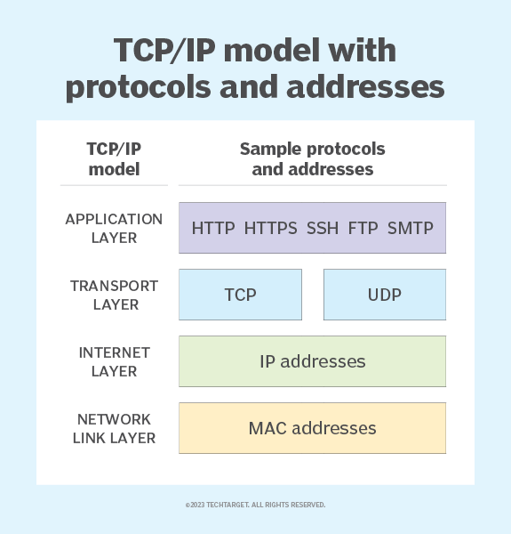

{/* truncate */}

# 理解全栈
今天突然理解了全栈技术是在做什么，简单组合为数据库+接口+网页
1. 使用Spring Boot快速创建一个项目，并在之后管理项目；
2. 配置数据库连接，一般在 applications.yml;
3. 创建一个实体类，映射到数据表，就是在 Java 项目里，重新创建一次数据库的名字，以便于在Java项目里进行应用；
4. 创建数据库与Java项目的接口，在 Mapper层，使用MyBatis工具，定义SQL操作的接口；
5. Service 层实现业务；
6. Controller 层用于定义实际的 API 接口。通过 @RestController 创建 RESTFUL 接口
7. API接口给到前端，使用组件进行数据的展示，或者输入数据保存到数据库。

数据库：Mysql,SQL...(MyBatis 提供了灵活的SQL定制能力)

写接口语言：Java, Go, Python(Flask,Django)

前端：React, Vue,Flutter

前端和后端需要进行交互，即使用http进行交互。http 涉及到计算机网络的知识

测试
持续部署：CI/CD(我的体验，写dockerfile,在github 上使用github pages进行部署)
部署：docker,kubernetes

太棒啦，在公司实习，我终于理解了一个软件产品的整个生产流程是怎样的。喔吼吼，一切变得简单起来，但是能理解得东西又变得躲起来，真棒。

